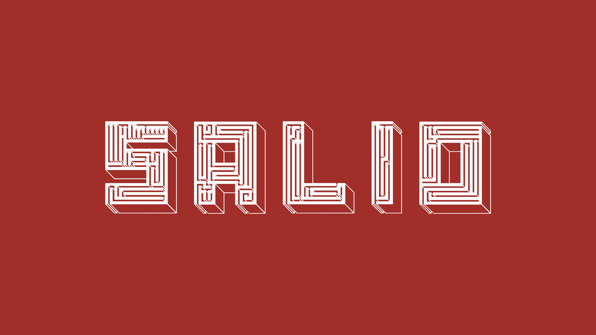

# 📖 Overview

*Salio Demo (click to open)*

**Salio** is an augmented reality puzzle game developed in Unity, where the player guides a ball through physical mazes using printed markers and magnetic forces. The game combines **marker-based AR interaction, physics-based gameplay, and environmental conditions** to create different challenges across four levels.

The game features:

* **Marker-based AR gameplay**, using one marker to control the maze and another to control the magnetic force.
* **Four levels** with progressively different mechanics: attraction, repulsion, dual-sided magnets, and two simultaneous mazes.
* **Physics-based ball movement**, with custom gravity relative to the orientation of the AR maze.
* **Multiple interaction strategies**, allowing players to move and rotate either the maze or the magnet to guide the ball.
* **Environmental lighting system**, where room luminosity dynamically affects the visibility and fog of the maze.
* **Time-based challenges**, requiring the player to reach the goal before each level's timer expires.
* **AR tracking stabilization and filtering** to reduce jitter and improve the reliability of physics interactions.

---

# 🛠️ Setup

1. Install the provided **APK** on an Android mobile device.
2. Extract, **print, and cut out the markers** to use them for interacting with the game. The required **AR markers** can be found [here](repo_description/markers/markers_for_printing.pdf).
3. Place the markers on a preferably plain surface, such as a desk, and open the game.

The game requires two markers:

* **Maze Marker** — controls the position and rotation of the maze.

* **Magnet Marker** — controls the position and rotation of the magnetic force.

---

# 🎬 Documentation

* Report: [Salio Report](repo_description/report.pdf)
* Build: [Salio APK](builds/Salio.apk)

---

# 👥 Authors

* **António Matos** ([GitHub](https://github.com/AntonioMatosGitHub))
* **Martim Miranda Maciel** ([GitHub](https://github.com/Aecesaje))
* **Pedro Miguel Meruge Ferreira** ([GitHub](https://github.com/pedromeruge))

---

"Virtual and Augmented Reality" Course Project - Faculty of Engineering, University of Porto 2024/2025
